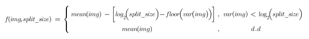
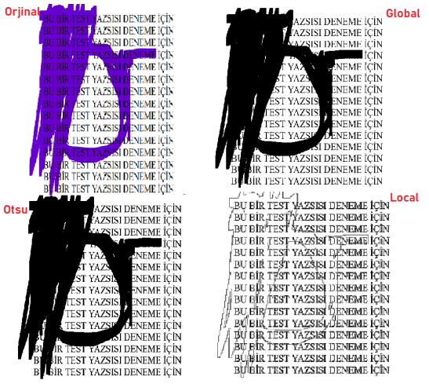
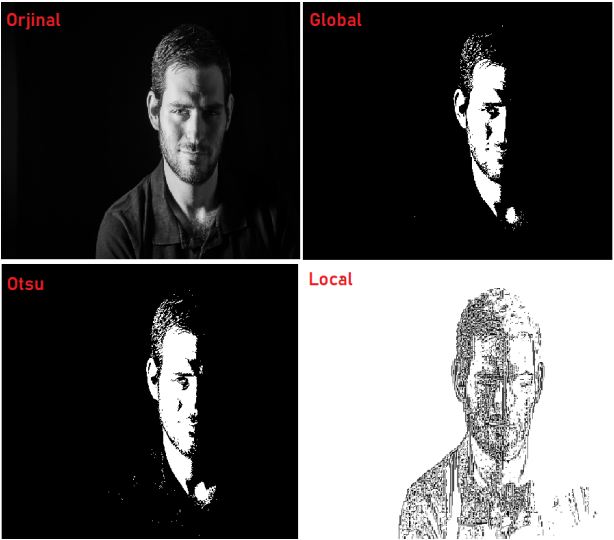
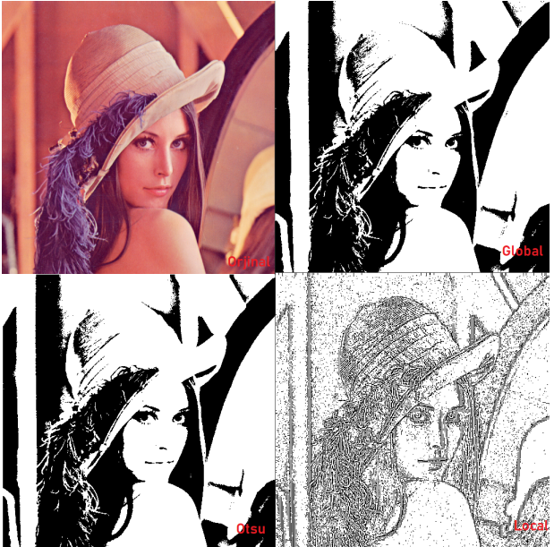

# Image Thresholding
> Image binarization is the process of taking a grayscale image and converting it to black-and-white, essentially reducing the information contained within the image from 256 shades of gray to 2: black and white, a binary image.

> This algorithm divides images into blocks and binarizes them locally.

> Algorithm that i created for determining threshold value can be seen below.

# Results

